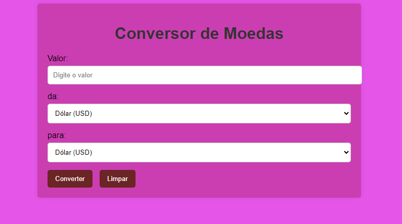

## Conversor de Moedas - API
Este é um projeto simples de conversão de moedas desenvolvido com JavaScript e uma API de taxas de câmbio. O aplicativo permite que o usuário insira um valor em uma moeda de origem e converta esse valor para uma moeda de destino, utilizando as taxas de câmbio mais recentes.

## 🚀 Visão Geral
O Conversor de Moedas consulta a API pública exchangerate-api.com para obter as taxas de câmbio em tempo real. O usuário pode inserir um valor e escolher entre várias moedas para realizar a conversão.

## Funcionalidades Principais:
Conversão de valores entre USD, EUR, e BRL.
Exibição do valor convertido com base nas taxas de câmbio mais recentes.
Formulário simples para entrada de valor e seleção das moedas.
Interface amigável e fácil de usar.

## ⚙️ Tecnologias Utilizadas
HTML5: Estrutura da página.
CSS3: Estilo e layout visual.
JavaScript (ES6): Lógica de conversão e interação com a API.
API exchangerate-api.com: Fornece as taxas de câmbio em tempo real.

## 📜 Explicação Geral
Este aplicativo permite que o usuário converta valores de uma moeda para outra (por exemplo, de BRL para USD) utilizando a API exchangerate-api.com. O fluxo funciona da seguinte maneira:

O usuário insere o valor a ser convertido.
O usuário escolhe a moeda de origem e a moeda de destino.
O código faz uma requisição à API e exibe o valor convertido de acordo com a taxa de câmbio mais atual.

## 🔍 Como Funciona
Configuração Inicial:
apiKey e apiURL: O código define a chave da API (apiKey) e a URL base da API (apiURL), que são necessários para autenticar as solicitações à API de taxas de câmbio.
Função getExchangeRate:
Esta função assíncrona busca a taxa de câmbio entre duas moedas e realiza a conversão. Os parâmetros são:

deMoeda: A moeda de origem (de qual moeda estamos convertendo).
paraMoeda: A moeda de destino (para qual moeda estamos convertendo).
Como Funciona a Função:
A função faz uma requisição HTTP para a API utilizando a URL apiURL, que inclui o valor da moeda de origem.
Se a requisição for bem-sucedida (data.result === 'success'), a função retorna a taxa de câmbio da moeda de origem para a moeda de destino (data.conversion_rates[paraMoeda]).
Caso contrário, um erro é lançado, alertando o usuário.

## 🛠️ Como Usar
Digite o valor que deseja converter no campo de texto.
Selecione a moeda de origem e a moeda de destino.
Clique no botão de conversão para realizar a conversão.
O valor convertido será exibido na tela, baseado nas taxas de câmbio mais recentes.

## Estrutura do Projeto

# Autora
[Hilary Freire](https://github.com/hilaryfreire?tab=repositories)

